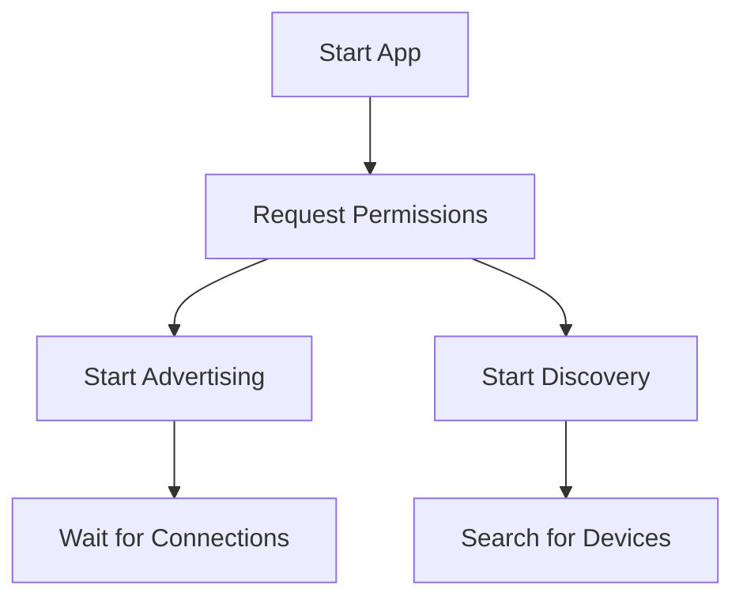
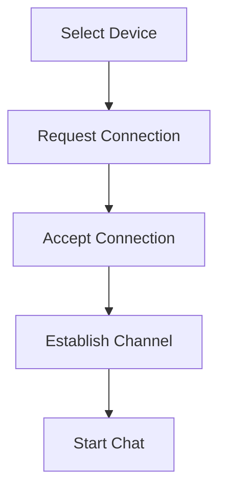
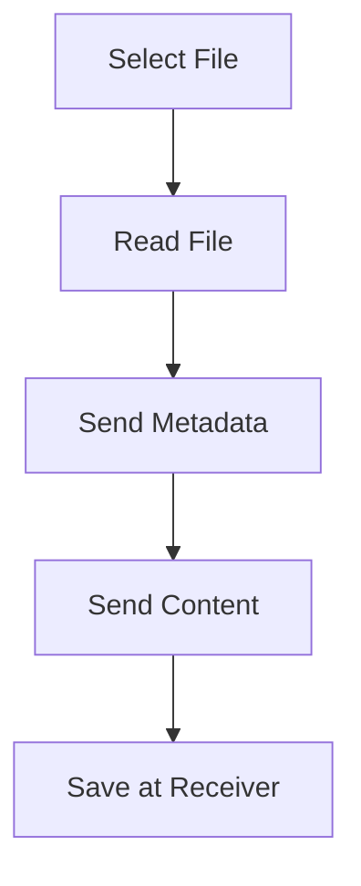

# P2P Chat Application

A Flutter application for direct messaging and file sharing between devices using P2P (Peer-to-Peer) technologies.

## Technologies Used

### Framework & Programming
- 🎯 **Dart** 3.0.0 - Core programming language
- 🚀 **Flutter** 3.16.0 - UI framework
- 📱 **Material Design 3** - Design system

### Connectivity & Networking
- 🤝 **Nearby Connections API** - For P2P connectivity
- 📡 **Bluetooth** - For discovery and connection
- 📶 **WiFi** - For fast data transfer

### State Management
- 🔄 **Provider** - For app state management
- 🎯 **ChangeNotifier** - For reactive updates

### Data Storage
- 💾 **File System** - For storing files and chats
- 📂 **Path Provider** - For managing storage paths
- 📄 **JSON** - For structured data storage

### File Handling
- 📁 **File Picker** - For file selection
- 🎵 **Just Audio** - For audio playback
- 🎥 **Video Player** - For video playback
- 🖼️ **Image** - For image display and handling

## Design Patterns & Principles

### Design Patterns
- 🏗️ **MVVM (Model-View-ViewModel)**
  - Model: `Message`, `Device`
  - View: `ChatScreen`, `DeviceDiscoveryScreen`
  - ViewModel: `ConnectionService`, `MessageService`

- 🎯 **Singleton**
  - Implemented in services for single instance

- 📦 **Repository Pattern**
  - Separation of data access logic
  - Data source abstraction

- 🔄 **Observer Pattern**
  - Using `ChangeNotifier`
  - Reactive UI updates

### SOLID Principles
- 📍 **Single Responsibility**
  - Separated service responsibilities
  - Dedicated services for connection and messaging

- 🔓 **Open/Closed**
  - Extensible design
  - Support for new message types

- 🔄 **Interface Segregation**
  - Purpose-specific interfaces
  - Separated file type handling

### Best Practices
- 📝 **Clean Code**
  - Descriptive naming
  - Small, focused units
  - Meaningful comments

- 🧪 **Error Handling**
  - Comprehensive error handling
  - Detailed logging
  - Clear user feedback

- 🔒 **Security**
  - Permission validation
  - File validation
  - Stored data protection

## Project Structure

## Features

- 📱 Automatic device discovery
- �� Direct messaging
- �� Image sharing
- 🎥 Video sharing
- 🎵 Audio file sharing
- 📂 Public file sharing
- 🔄 Chat synchronization
- 📍 No internet connection required

## Requirements

- Flutter SDK
- Android Studio / VS Code
- Android device supporting Bluetooth and WiFi
- Android API Level 21 or higher

## Installation

1. Clone the project:
```bash
git clone https://github.com/yourusername/your-repo-name.git
```

2. Install dependencies:
```bash
flutter pub get
```

3. Run the application:
```bash
flutter run
```

## Required Permissions

The application requires the following permissions:
- `BLUETOOTH`
- `BLUETOOTH_ADMIN`
- `ACCESS_WIFI_STATE`
- `CHANGE_WIFI_STATE`
- `ACCESS_COARSE_LOCATION`
- `ACCESS_FINE_LOCATION`
- `READ_EXTERNAL_STORAGE`
- `WRITE_EXTERNAL_STORAGE`

## Project Structure
lib/
├── main.dart # Application entry point
├── screens/ # UI screens
│ ├── device_discovery_screen.dart # Device discovery screen
│ └── chat_screen.dart # Chat screen
├── services/ # Services
│ ├── connection_service.dart # Connection service
│ └── message_service.dart # Message service
├── models/ # Data models
│ ├── device.dart # Device model
│ └── message.dart # Message model
└── utils/ # Utilities
├── constants.dart # Constants
└── helpers.dart # Helper functions


## Features

- 📱 Automatic device discovery
- 💬 Real-time text messaging
- 📸 Image sharing
- 🎥 Video sharing
- 🎵 Audio file sharing
- 📂 General file sharing
- 🔄 Chat synchronization
- 📍 No internet required

## Requirements

### System Requirements
- Android SDK: API Level 21+
- Flutter: 3.16.0+
- Dart: 3.0.0+
- RAM: 2GB+
- Storage: 100MB+

### Device Requirements
- Bluetooth 4.0+
- WiFi Direct support
- GPS/Location Services
- Camera (optional)
- Microphone (optional)

## Installation

1. Clone the repository:
```bash
git clone https://github.com/yourusername/your-repo-name.git
```

2. Install dependencies:
```bash
flutter pub get
```

3. Run the application:
```bash
flutter run
```

## Required Permissions
- `BLUETOOTH`
- `BLUETOOTH_ADMIN`
- `ACCESS_WIFI_STATE`
- `CHANGE_WIFI_STATE`
- `ACCESS_COARSE_LOCATION`
- `ACCESS_FINE_LOCATION`
- `READ_EXTERNAL_STORAGE`
- `WRITE_EXTERNAL_STORAGE`

## Application Flow

### 1. Device Discovery


### 2. Connection Establishment


### 3. File Transfer


## File Storage Paths

Files are stored in the following paths:

Android/media/com.example.blutoth_app_wifi/
├── images/
├── videos/
├── audio/
└── files/


## Performance Optimizations

### Performance
- 🚀 Using `Future.microtask` for async updates
- 📦 Optimized memory usage
- 🔄 Efficient resource management

### User Experience
- ⚡ Progressive content loading
- 📊 File transfer progress indicators
- 🎯 Immediate interaction feedback

## Future Development

### Planned Features
- 🔐 End-to-end encryption
- 👥 Group support
- 🌐 Translation support
- 📱 iOS support

### Future Improvements
- ⚡ Enhanced file transfer speed
- 🔄 Improved synchronization
- 🎨 Greater UI customization

## Technical Documentation

### API Documentation
- [Nearby Connections API](https://developers.google.com/nearby/connections/overview)
- [Flutter Documentation](https://flutter.dev/docs)
- [Dart Documentation](https://dart.dev/guides)

### Additional References
- [Material Design Guidelines](https://m3.material.io/)
- [Flutter Best Practices](https://flutter.dev/docs/perf/best-practices)
- [Dart Style Guide](https://dart.dev/guides/language/effective-dart/style)

## Contributing

We welcome contributions! Please follow these steps:
1. Fork the project
2. Create a feature branch
3. Submit a pull request

## License

This project is licensed under the [MIT License](LICENSE).

## Support

If you encounter any issues, please open an issue on GitHub.

## Acknowledgments

- [nearby_connections](https://pub.dev/packages/nearby_connections)
- [path_provider](https://pub.dev/packages/path_provider)
- [file_picker](https://pub.dev/packages/file_picker)